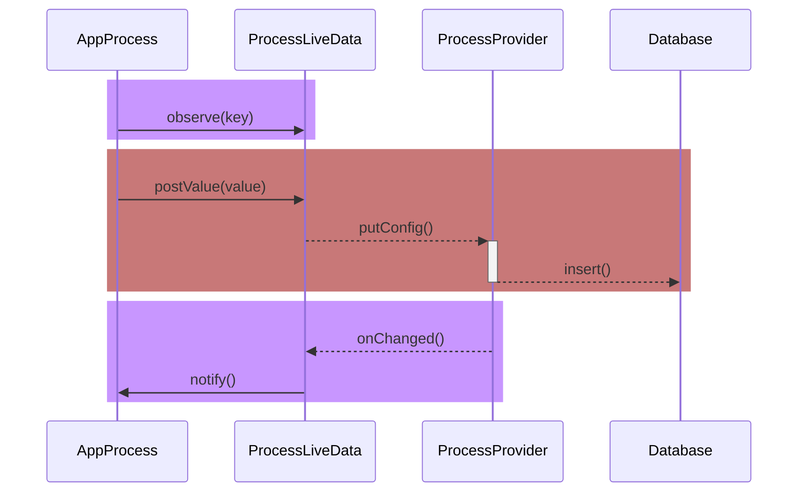
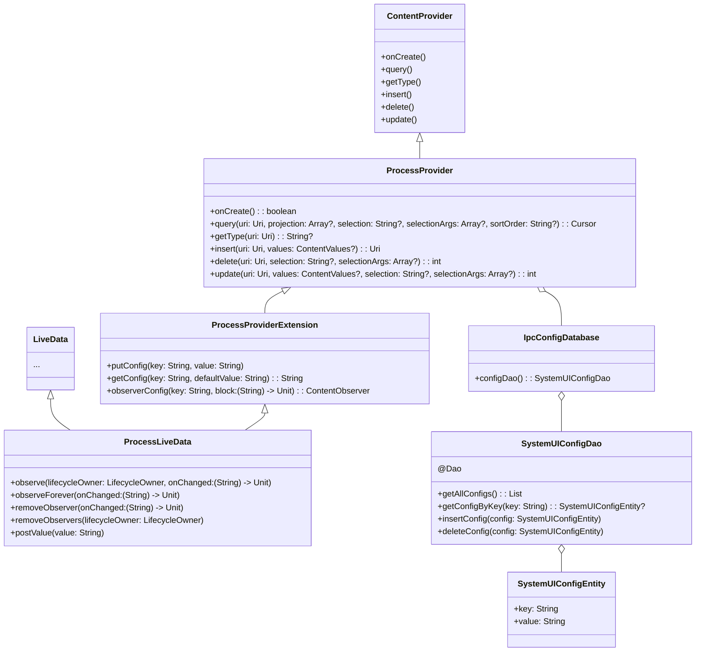

# ProcessLiveData
基于ContentProvider的Android进程间键值传递工具
> Android Inter-process Key-value Transmission Tool Based on ContentProvider

## 特性

1. 使用LiveData跨进程对键值对进行修改或监听
2. 使用ContentProvider作为跨进程方式
3. 使用Room存储数据

## 使用方法
### 数据提供方

和常规的`LiveData`与`ContentProvider`使用一致, 在数据提供方的应用中继承`ProcessProvider`和`ProcessLiveData`, 需要先在`AndroidManifest.xml`文件中声明Provider, 目前Provider的uri是固定的, 如下设置即可
```xml
    <application>
        <provider
            android:name="com.popkter.processlivedata.ProcessProvider"
            android:authorities="com.popkter.proceelivedata"
            android:exported="true"/>
    </application>
```
~~_`ProcessProvider`支持重写, 可以继承此类重写URI_.(**_NOT YET_**)~~

数据提供方可通过`ProcessProviderExtension`中对于`ContentResolver`的拓展方法操作数据. 需要注意, `String 键值对`的**key**需要告知调用方才能使其获取到对应的**value**, 如下:
```kotlin

        contentResolver.putConfig("test_key",10086.toString())
        
        contentResolver.getConfig("test_key",10086.toString())
        
        val observer  = contentResolver.observerConfig("test_key"){str->
            // TODO:
        }

```
当然, 也可以使用`ProcessLiveData`, 不过不如使用上面的方式来的痛快. 详见下文.

### 数据使用方

使用方需要在`AndroidManifest.xml`中声明数据提供方的包名(Android11后的安全规则),如下:
```xml
    <queries>
        <!-- 请替换成自己的包名 -->
        <package android:name="com.popkter.processlivedata_app"/>
    </queries>
```

而后可在代码中进行数据的观察和设置. 需要注意的是,因为基于`ContentProvider`, 所以需要传入`ContentResolver`, 以及目前仅支持`String 键值对`的操作, 因此在观察的时候需要传入一个**key**, 才能够观察到对应的**value**, 如下:

```kotlin

        val liveData = ProcessLiveData(contentResolver,"test_key")
        liveData.observe(this){ str->
            //TODO
        }

        liveData.postValue("10086")
        
```
以上. 需要定制传输数据, fork本项目到本地后定制即可.
## 引用
### 作为依赖引入现有项目

**Step 1.** Add it in your root build.gradle at the end of repositories:

```groovy
	dependencyResolutionManagement {
		//...
		repositories {
			mavenCentral()
			maven { url 'https://jitpack.io' }
		}
	}
```

**Step 2.** Add the dependency

```groovy
	dependencies {
	        implementation 'com.github.popkter:ProcessLiveData:1.1'
	}
```
	

### (可选) 作为单独的数据中介应用

直接clone项目到本地后运行.


## 时序图
> sequenceDiagram



## 类图
> classDiagram


